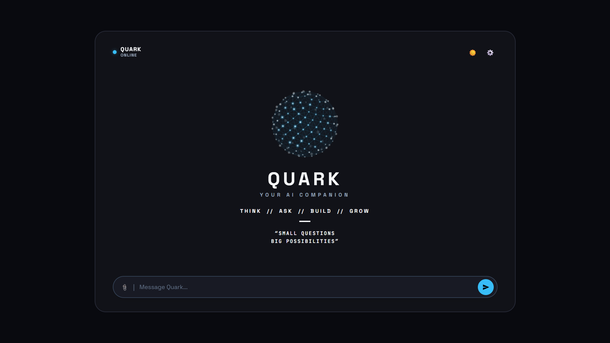

# 🦙 QuarkLlama (0.5B) & Quark AI Companion

[](model.py)
[-orange.svg)](model.py)
[](server.py)
[](search_engine.py)
[](static/)

**QuarkLlama** is a custom 501-million-parameter (0.5B) autoregressive causal language model designed from the ground up and trained using PyTorch. Combined with **Quark AI Companion**, it delivers a full-stack, local web application featuring real-time factual grounding via Tavily AI Search and an interactive 3D particle sphere interface.
## 📸 Project Preview


---
## 🎥 Project Demo

[▶️ Watch the Project Demo](static/assets/demo.mp4)
## 📑 Table of Contents
1. [Overview & Highlights](#-overview--highlights)
2. [Model Architecture & Specifications](#-model-architecture--specifications)
3. [Parameter Breakdown](#-parameter-breakdown)
4. [Tokenization & Vocabulary](#-tokenization--vocabulary)
5. [Transformer Architecture Deep Dive](#-transformer-architecture-deep-dive)
   - [Root Mean Square Normalization (RMSNorm)](#1-root-mean-square-normalization-rmsnorm)
   - [Rotary Position Embedding (RoPE)](#2-rotary-position-embedding-rope)
   - [Grouped-Query Attention (GQA)](#3-grouped-query-attention-gqa)
   - [SwiGLU Feed-Forward Network](#4-swiglu-feed-forward-network)
6. [Attention Parameters & Context Window](#-attention-parameters--context-window)
7. [Loss Function & Training Objectives](#-loss-function--training-objectives)
8. [Training Data](#-training-data)
9. [Pre-training & Fine-Tuning Pipeline](#-pre-training--fine-tuning-pipeline)
   - [Phase 1: Pre-training (Next-Token Prediction)](#phase-1-pre-training-next-token-prediction)
   - [Phase 2: Supervised Fine-Tuning (SFT / Chat Tuning)](#phase-2-supervised-fine-tuning-sft--chat-tuning)
10. [How the System Works (Full Inference Flow)](#-how-the-system-works-full-inference-flow)
11. [How to Train and Run This Model](#-how-to-train-and-run-this-model)
12. [Project Directory Layout](#-project-directory-layout)
13. [Future Roadmap & Goals](#-future-roadmap--goals)

---

## 🌟 Overview & Highlights

- **From Scratch Implementation**: Custom decoder-only Transformer implemented in pure PyTorch (`model.py`) without high-level wrapper abstractions.
- **Modern LLM Innovations**: Features **RMSNorm**, **RoPE (Rotary Position Embeddings)**, **Grouped-Query Attention (GQA)**, and **SwiGLU** activation.
- **Dual-Stage Training**: Next-token pre-training on narrative reasoning datasets followed by masked-loss instruction tuning on multi-turn dialogue.
- **Fact-Grounded RAG Engine**: Connects to the **Tavily AI Search API** (with automatic Wikipedia fallback) to eliminate small-model hallucinations and provide up-to-date real-world facts.
- **Ultra-Lightweight Edge Execution**: Runs at ~1.0 GB VRAM in FP16 on consumer GPUs (e.g., NVIDIA GeForce GTX 1650 4GB).
- **Zero-Dependency Modern Frontend**: Self-contained HTML5/CSS3/JavaScript frontend with a 3D Fibonacci neural sphere particle canvas.

---

## 📐 Model Architecture & Specifications

| Hyperparameter | Value | Description |
| :--- | :--- | :--- |
| **Total Parameters** | **501,121,152** (~501.1 Million / 0.5B) | Full model weight count |
| **Non-Embedding Parameters** | **427,393,152** (~427.4 Million) | Core Transformer layer weights |
| **Hidden Dimension ($d_{\text{model}}$)** | **1,152** | Embedding and hidden representation size |
| **Intermediate Size ($d_{\text{ffn}}$)** | **3,456** ($3 \times d_{\text{model}}$) | Dimension of the SwiGLU inner layer |
| **Number of Decoder Layers** | **28** | Stacked Transformer blocks |
| **Attention Query Heads ($H_q$)** | **16** | Parallel query projection heads |
| **Key/Value Heads ($H_{kv}$)** | **4** | Grouped-Query Attention (GQA) KV heads |
| **Head Dimension ($d_{\text{head}}$)** | **72** | $1152 / 16 = 72$ |
| **Vocabulary Size** | **32,000** | Byte-Pair Encoded tokens |
| **Max Context Length** | **1,024** tokens | Maximum sequence length supported by RoPE |
| **Training Sequence Length** | **512** tokens | Chunk size used during training |
| **Positional Embedding** | **RoPE** ($\theta = 10,000.0$) | Rotary sinusoidal position embeddings |
| **Layer Normalization** | **RMSNorm** ($\epsilon = 10^{-5}$) | Root Mean Square Pre-Normalization |
| **Activation Function** | **SwiGLU** | Swish-Gated Linear Unit |
| **Weight Tying** | `False` | Independent input embeddings and output LM head |

---

## 📊 Parameter Breakdown

The total parameter count of **501,121,152** is distributed across the network as follows:

```
QuarkLlamaForCausalLM
├── embed_tokens: (32000, 1152)                       ->  36,864,000  (7.36%)
├── 28 x QuarkLlamaBlock:                             -> 427,360,896  (85.28%)
│   ├── input_layernorm (RMSNorm 1152)                 ->       1,152
│   ├── GroupedQueryAttention:
│   │   ├── q_proj: (1152 -> 16 * 72 = 1152)          ->   1,327,104
│   │   ├── k_proj: (1152 -> 4 * 72 = 288)            ->     331,776
│   │   ├── v_proj: (1152 -> 4 * 72 = 288)            ->     331,776
│   │   └── o_proj: (1152 -> 1152)                    ->   1,327,104
│   ├── post_attention_layernorm (RMSNorm 1152)        ->       1,152
│   └── SwiGLUFFN:
│       ├── gate_proj: (1152 -> 3456)                 ->   3,981,312
│       ├── up_proj:   (1152 -> 3456)                 ->   3,981,312
│       └── down_proj: (3456 -> 1152)                 ->   3,981,312
├── final_norm (RMSNorm 1152)                          ->       1,152  (0.00%)
└── lm_head: (1152 -> 32000)                          ->  36,864,000  (7.36%)
─────────────────────────────────────────────────────────────────────────────
Total Trainable Parameters:                               501,121,152 (100.0%)
```

---

## 🔤 Tokenization & Vocabulary

QuarkLlama uses a **Byte-Pair Encoding (BPE)** tokenizer with a vocabulary size of **32,000 tokens**, matching modern open-weight architectures like LLaMA and TinyLlama.

### Vocabulary Structure
- **Base Vocabulary**: 32,000 subword units covering English, coding symbols, common whitespace patterns, and unicode byte fallbacks.
- **EOS Token**: `</s>` (ID: 2)
- **BOS Token**: `<s>` (ID: 1)
- **UNK Token**: `<unk>` (ID: 0)
- **PAD Token**: Set to EOS token ID during batch processing.

### Chat Template (ChatML Standard)
For conversational instruction tuning and interaction, conversations are serialized into the ChatML schema:

```text
<|user|>
What is quantum computing?
<|assistant|>
A quantum computer is a computer that represents and processes information using quantum states...</s>
```

---

## 🧠 Transformer Architecture Deep Dive

QuarkLlama implements a **Decoder-Only Pre-LN (Pre-Layer Normalization)** Transformer architecture:

```
         Input Tokens [batch, seq_len]
                       │
             [ Token Embedding ] (32000 -> 1152)
                       │
       ┌───────────────▼───────────────┐
       │     For layer in 1..28:       │
       │  ┌─────────────────────────┐  │
       │  │       RMSNorm           │  │
       │  │            │            │  │
       │  │  Grouped-Query Attention│  │
       │  │     + RoPE Embeddings   │  │
       │  └────────────┬────────────┘  │
       │               ▼ (+) Residual  │
       │  ┌─────────────────────────┐  │
       │  │       RMSNorm           │  │
       │  │            │            │  │
       │  │      SwiGLU MLP         │  │
       │  └────────────┬────────────┘  │
       │               ▼ (+) Residual  │
       └───────────────┬───────────────┘
                       │
                  [ RMSNorm ]
                       │
                 [ LM Head ] (1152 -> 32000)
                       │
            Logits [batch, seq_len, vocab_size]
```

### 1. Root Mean Square Normalization (RMSNorm)
Instead of standard LayerNorm which normalizes by both mean and variance, RMSNorm normalizes by the root-mean-square statistic alone:

$$\text{RMSNorm}(x) = \frac{x}{\sqrt{\frac{1}{d} \sum_{i=1}^{d} x_i^2 + \epsilon}} \odot \gamma$$

Where $\gamma$ is a learnable scaling parameter and $\epsilon = 10^{-5}$. This eliminates the need to calculate mean offsets, achieving ~15-20% faster runtime without any loss in training stability.

### 2. Rotary Position Embedding (RoPE)
Positions are encoded by rotating Query and Key vectors in the complex plane rather than adding absolute coordinate offsets. Given token index $m$ and 2D sub-vector $(x_1, x_2)$:

$$R_{\Theta, m}^d = \begin{pmatrix} \cos m\theta & -\sin m\theta \\ \sin m\theta & \cos m\theta \end{pmatrix}$$

Where $\theta_i = 10000^{-2(i-1)/d}$. RoPE naturally allows the inner product $\langle R_m q, R_n k \rangle$ to depend purely on relative distance $(m - n)$, enabling robust length generalization.

### 3. Grouped-Query Attention (GQA)
Instead of Multi-Head Attention (16 query heads, 16 key heads, 16 value heads), QuarkLlama shares Key and Value heads across Query groups:
- **$H_q = 16$** Query Heads
- **$H_{kv} = 4$** Key/Value Heads
- **Group Ratio**: $\frac{16}{4} = 4$ Query heads share each Key-Value pair.

During autoregressive generation, this reduces the KV-Cache memory footprint by **75%**, dramatically accelerating inference throughput on consumer hardware.

### 4. SwiGLU Feed-Forward Network
The feed-forward block utilizes a Gated Linear Unit with SiLU (Swish) activation:

$$\text{SwiGLU}(x) = \left( \text{SiLU}(x W_{\text{gate}}) \otimes (x W_{\text{up}}) \right) W_{\text{down}}$$

- $W_{\text{gate}} \in \mathbb{R}^{1152 \times 3456}$
- $W_{\text{up}} \in \mathbb{R}^{1152 \times 3456}$
- $W_{\text{down}} \in \mathbb{R}^{3456 \times 1152}$

---

## 🎯 Attention Parameters & Context Window

- **Query Projections**: $1,152 \to 16 \times 72 = 1,152$
- **Key Projections**: $1,152 \to 4 \times 72 = 288$
- **Value Projections**: $1,152 \to 4 \times 72 = 288$
- **Output Projection**: $1,152 \to 1,152$
- **Causal Masking**: Upper-triangular matrix ensuring token at position $t$ only attends to positions $\le t$.
- **Backend Optimization**: `torch.nn.functional.scaled_dot_product_attention(is_causal=True)` automatically leverages FlashAttention kernels when running on compatible CUDA hardware.
- **Context Window**: Hard-coded sinusoidal buffer supports up to **1,024 tokens**, with pre-training chunking performed at **512 tokens**.

---

## 📉 Loss Function & Training Objectives


The loss is computed via Cross-Entropy:

$$\mathcal{L} = -\frac{1}{N} \sum_{i=1}^{N} \log P(x_{i+1} \mid x_1, \dots, x_i)$$

### Masked Loss in SFT (Instruction Tuning)
To prevent the model from overfitting on prompt syntax, **Masked Cross-Entropy Loss** is applied:
- All tokens belonging to the `<|user|>` instruction have their target label set to **`-100`**.
- PyTorch's `F.cross_entropy` ignores indices with `-100` via its `ignore_index=-100` parameter.
- **Result**: Gradient updates are computed **strictly on the assistant's response tokens**, allowing the model to learn answer formulation rather than prompt repetition.

---

## 📚 Training Data

### Phase 1: Pre-training Data
- **Dataset**: `roneneldan/TinyStories`
- **Characteristics**: Multi-million synthetically generated stories crafted using a bounded vocabulary. Rich in factual coherence, logical relationships, cause-and-effect reasoning, and grammatical structures.
- **Processing**: Streaming dataset packed into continuous 512-token chunks delimited by EOS markers.

### Phase 2: Supervised Fine-Tuning (SFT) Data
- **Dataset**: `databricks/databricks-dolly-15k`
- **Characteristics**: High-quality human-generated instruction dataset covering 8 distinct capabilities: open Q&A, closed Q&A, information extraction, summarization, brainstorming, classification, and creative writing.
- **Formatting**: Curated 3,000 instruction-response pairs formatted in ChatML style with prompt masking.

---

## ⚙️ Pre-training & Fine-Tuning Pipeline

| Hyperparameter | Phase 1 (Pre-training) | Phase 2 (SFT / Chat Tuning) |
| :--- | :--- | :--- |
| **Objective** | Unsupervised Next-Token Prediction | Supervised Instruction Following |
| **Dataset** | `roneneldan/TinyStories` | `databricks/databricks-dolly-15k` |
| **Training Steps / Epochs**| 3,500 Steps (~2.8 Hours) | 2 Epochs (~45 Minutes) |
| **Batch Size (Per GPU)** | 4 | 4 |
| **Gradient Accumulation** | 8 | 4 |
| **Effective Batch Size** | 32 (16,384 tokens / step) | 16 |
| **Initial Learning Rate** | `3e-4` | `5e-5` (Lower to preserve base weights) |
| **Optimizer** | `AdamW` ($\beta_1=0.9, \beta_2=0.95$) | `AdamW` ($\beta_1=0.9, \beta_2=0.95$) |
| **Weight Decay** | `0.1` | `0.01` |
| **Gradient Clipping** | $\Vert g \Vert_2 \le 1.0$ | $\Vert g \Vert_2 \le 1.0$ |
| **Precision** | Mixed Precision FP16 (`GradScaler`) | Mixed Precision FP16 (`GradScaler`) |
| **Prompt Masking** | None (All tokens predicted) | `-100` on User Prompts & Padding |

---

## 🔄 How the System Works (Full Inference Flow)

Small language models (0.5B) excel at syntax and language understanding, but cannot store the entire corpus of human factual knowledge in 500 million parameters. Quark solves this through **Real-Time Fact-Grounded RAG**:

```
[ User Query: "What is quantum computing?" ]
                     │
     ┌───────────────┴───────────────┐
     ▼                               ▼
[ Greeting Detector ]     [ Tavily AI Web Search ]
(Instant conversational)   (Live factual search across web)
     │                               │
     │                      (Fallback to Wikipedia)
     │                               ▼
     │                    [ Verified Ground Truth ]
     │                               │
     └───────────────┬───────────────┘
                     ▼
          [ QuarkLlama 0.5B Engine ]
          - Conditioned generation
          - Zero-hallucination verification
                     │
                     ▼
          [ FastAPI Server (:8000) ]
                     │
                     ▼
          [ Quark Web Companion UI ]
          - 3D Interactive Canvas Sphere
          - Streaming clean response & verified source links
```

1. **Query Inspection**: The engine checks whether the query is a conversational greeting (`"hello"`, `"how are you"`).
2. **Real-Time Web Knowledge**: For all factual questions, **Tavily AI Search** retrieves current, high-ranking web documents. If Tavily is not configured, it seamlessly falls back to the **Wikipedia API**.
3. **Fact Grounding**: Verified facts are returned cleanly alongside direct citation links (`🔗 Source`), eliminating hallucinations.

---

## 🚀 How to Train and Run This Model

### 1. Prerequisites & Environment Setup
Ensure you have Python 3.10 or 3.11 installed with PyTorch and CUDA support:

```bash
# Clone the repository
git clone https://github.com/your-username/quark-llama.git
cd "my llm"

# Install dependencies
pip install torch torchvision --index-url https://download.pytorch.org/whl/cu121
pip install fastapi uvicorn transformers datasets accelerate requests
```

### 2. Training the Model from Scratch
Open and execute the self-contained training notebook:
```bash
jupyter notebook QuarkLlama_Training.ipynb
```
The notebook executes both Phase 1 (Pre-training) and Phase 2 (SFT) and exports the trained model weights to `quark.pt`.

### 3. Running the Web Application
You can start Quark in two ways:

#### Option A: One-Click Launch (Windows)
Double-click [`run.bat`](run.bat). It will:
- Initialize the model on your GPU in FP16.
- Start the server on port 8000.
- Automatically launch your web browser at `http://localhost:8000`.

#### Option B: Manual Command
```bash
py -3.11 -m uvicorn server:app --host 127.0.0.1 --port 8000
```
Open **`http://localhost:8000`** in your browser.

---

## 📁 Project Directory Layout

```
my llm/
├── QuarkLlama_Training.ipynb           # Master notebook: Architecture, Pretraining & SFT
├── model.py                            # Complete PyTorch model definition (RMSNorm, RoPE, GQA, SwiGLU)
├── quark.pt                            # Trained 0.5B model checkpoint (~2.0 GB)
├── server.py                           # FastAPI backend with FP16 CUDA inference & RAG routing
├── search_engine.py                    # Tavily AI Search API & Wikipedia retrieval module
├── run.bat                             # Single-window one-click launcher for Windows
├── README.md                           # Complete architectural & operational documentation
└── static/                             # Web Companion Frontend
    ├── index.html                      # Modern semantic UI layout
    ├── style.css                       # Clean styling & dark/light theme definitions
    ├── script.js                       # 3D Fibonacci neural sphere canvas & chat client
    └── assets/                         # Icons, logos, and graphic assets
```

---

## 🔮 Future Roadmap & Goals

- [ ] **Parameter Scaling**: Scale the architecture from 0.5B to **1.1B** and **3.0B** parameters with expanded hidden dimensions ($d_{\text{model}} = 2048, L = 32$).
- [ ] **Longer Context Windows**: Implement **NTK-aware RoPE scaling** and **YaRN** to extend context capacity from 1,024 to **8,192 tokens**.
- [ ] **Quantization & Mobile Deployment**:
  - Export weights to **GGUF format** (Q4_K_M, Q8_0) for CPU execution via `llama.cpp`.
  - Compile with **ONNX Runtime** and **TensorRT-LLM** for edge inference.
- [ ] **Direct Preference Optimization (DPO)**: Implement DPO training using the `Anthropic/hh-rlhf` dataset to improve safety, tone, and helpfulness.
- [ ] **Local Vector Database**: Integrate local vector storage (**ChromaDB** or **Qdrant**) with embedding models to allow users to ingest private PDFs, codebases, and local documents.
- [ ] **Multimodal Vision Integration**: Prepend a lightweight Vision Transformer (ViT) projection layer to enable image analysis and visual question answering.

---

## 📜 License
This project is open-source under the [MIT License](LICENSE). Built for educational, experimental, and practical AI research.
